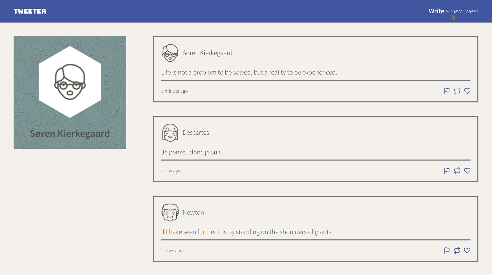

# Tweeter Project

Tweeter is a simple, single-page Twitter clone that was built with Node and Express on the back-end and jQuery, AJAX, and Day.js on the browser. Using media queries, Tweeter has a responsive design for mobile, tablet, and desktop.

## Final Product

        

## Dependencies

- Node.js
- Express
- body-parser
- jQuery
- Day.js (and its relativeTime plugin)
- Normalize.css
- Google Fonts
- Font Awesome

## Getting Started

1. Fork this repository, then clone your fork of this repository.
2. Install dependencies using the `npm install` command.
3. Start the web server using the `npm run local` command. The app will be served at <http://localhost:8080/>.
4. Go to <http://localhost:8080/> in your browser.
